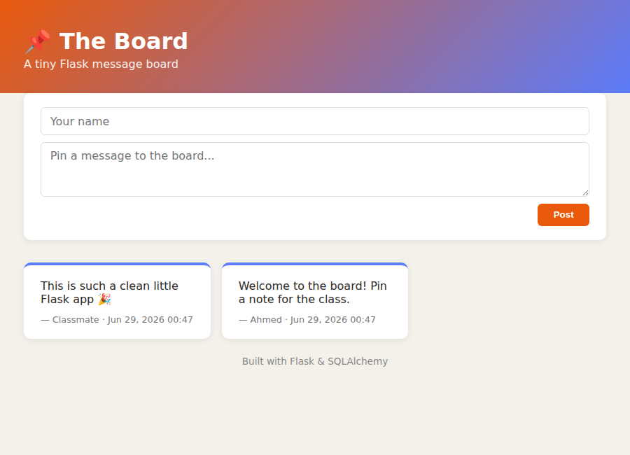

# 📌 The Board

A tiny Flask + SQLAlchemy message board, originally built as a class exercise. Visitors can read posts on the main page and pin their own message to the board.




## Features

- View all posted messages on `/main`, newest first
- Pin a new message with an optional author name
- Backed by SQLite via Flask-SQLAlchemy
- A unit test (`tests.py`) covering the main page

## Getting started

```bash
pip install -r requirements.txt
python board.py
```

Then open http://127.0.0.1:5000/main in your browser.

## Running the tests

```bash
python tests.py -v
```

## Project structure

```
board.py            # Flask app, model, and routes
templates/          # Jinja templates
static/style.css    # Styling
tests.py            # Unit tests
```
